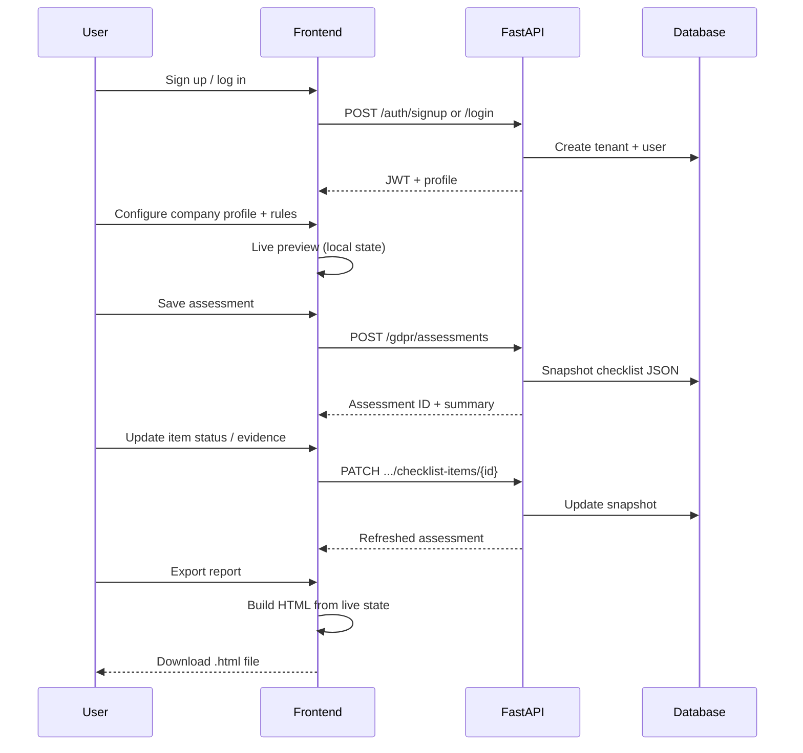
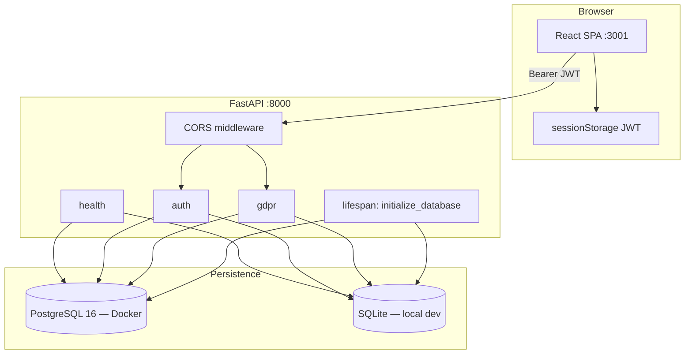
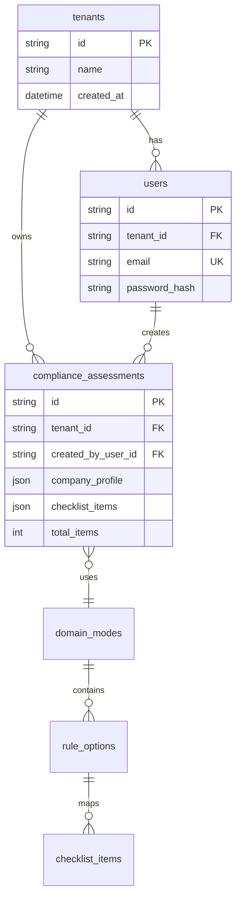
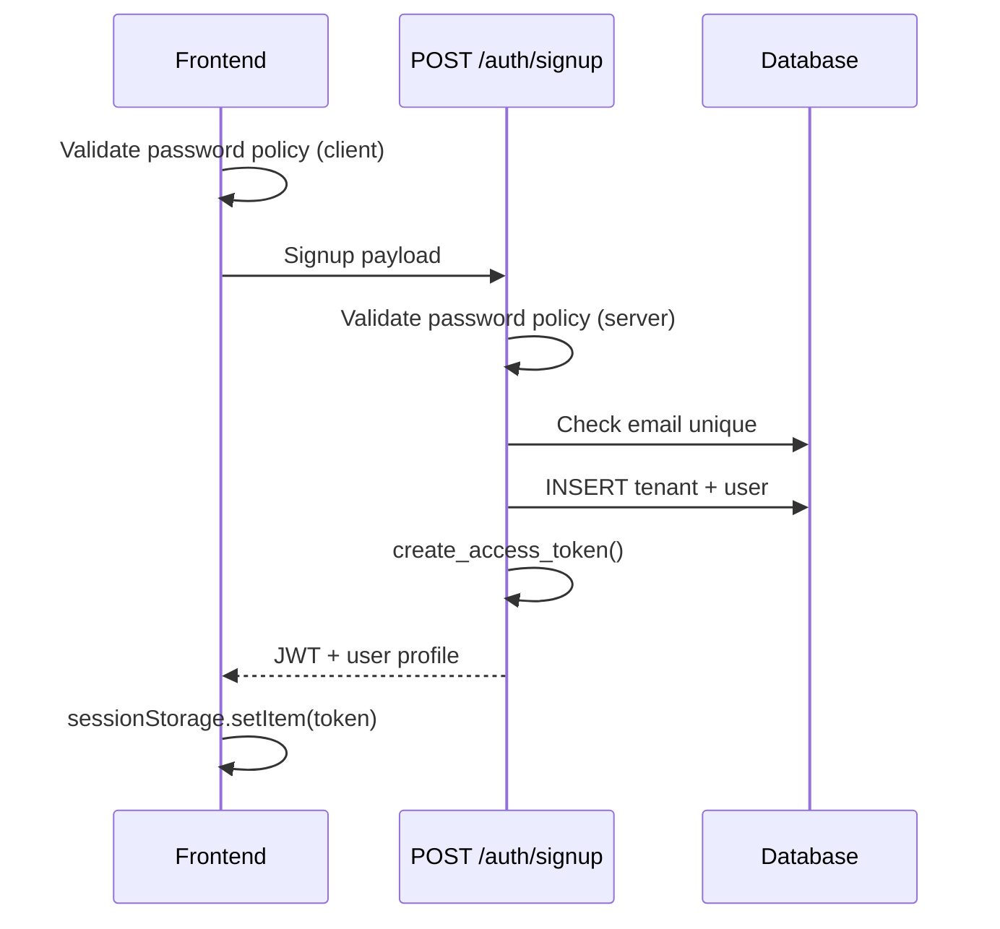
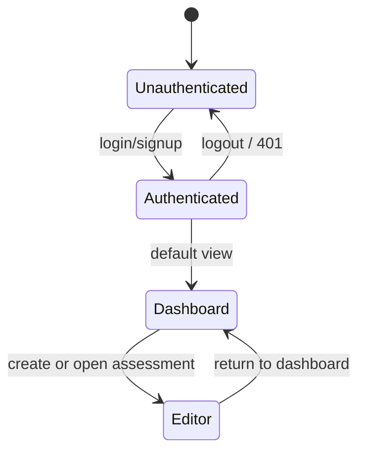
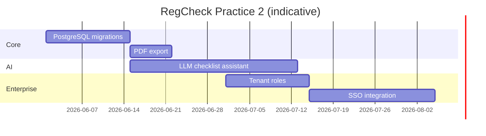

# RegCheck — Project Report (Extended)

**Generated:** 19-05-2026  
**Repository:** `regcheck`  
**Version:** 0.1.0 (MVP)  
**Status:** Active development — GDPR-focused compliance assistant  
**Primary audience:** Developers, reviewers, academic evaluators

---

## Table of contents

1. [Executive summary](#1-executive-summary)
2. [Academic context and deliverables](#2-academic-context-and-deliverables)
3. [Problem, solution, and use cases](#3-problem-solution-and-use-cases)
4. [Functional requirements](#4-functional-requirements)
5. [Scope and boundaries](#5-scope-and-boundaries)
6. [System architecture](#6-system-architecture)
7. [Technology stack](#7-technology-stack)
8. [Repository structure](#8-repository-structure)
9. [Data model and persistence](#9-data-model-and-persistence)
10. [GDPR catalog and rule engine](#10-gdpr-catalog-and-rule-engine)
11. [API reference](#11-api-reference)
12. [Authentication and authorization](#12-authentication-and-authorization)
13. [Frontend application](#13-frontend-application)
14. [User journeys](#14-user-journeys)
15. [Internationalization](#15-internationalization)
16. [Report export](#16-report-export)
17. [Configuration and environment](#17-configuration-and-environment)
18. [Development guide](#18-development-guide)
19. [Docker and deployment](#19-docker-and-deployment)
20. [Quality assurance and CI](#20-quality-assurance-and-ci)
21. [Documentation map](#21-documentation-map)
22. [Development chronology](#22-development-chronology)
23. [Academic compliance checklist](#23-academic-compliance-checklist)
24. [Roadmap — Practice 2 and beyond](#24-roadmap--practice-2-and-beyond)
25. [Security, risks, and limitations](#25-security-risks-and-limitations)
26. [Glossary](#26-glossary)
27. [Conclusion](#27-conclusion)

---

## 1. Executive summary

**RegCheck** (*Rules to actionable list translator*) is a web application that helps organizations understand which regulatory controls apply to them and what concrete actions they must take to demonstrate compliance. The first implementation targets **GDPR** (General Data Protection Regulation), with a rule catalog, contextual recommendations, prioritized checklists, evidence metadata, and exportable audit reports.

The product sits in the **Regulation and Compliance** track of an AI-assisted cybersecurity development practice. It combines:

- A **Python + FastAPI** REST API with SQL persistence
- A **React + TypeScript + Vite** single-page application
- **Multi-tenant authentication** (organization + user)
- A **deterministic rule engine** that maps company context to recommended controls
- **Assessment snapshots** that preserve checklist state and evidence over time

The MVP is functional end-to-end: users sign up, configure organizational context, generate and save assessments, track checklist progress, attach evidence references, and export HTML reports suitable for printing to PDF. The stack is containerized with Docker Compose (PostgreSQL in Docker; SQLite for frictionless local backend development).

**Strategic positioning:** RegCheck does not replace legal advice. It operationalizes regulation into checklists that SMEs can execute, while building an evidence trail suitable for internal audits and academic demonstration.

---

## 2. Academic context and deliverables

RegCheck aligns with **Practice 1 — Development of an AI-Powered Cybersecurity Tool** (Regulation and Compliance track). The subject document ([[Subject_pr1.EN]]) defines mandatory deliverables that this project addresses as follows:

| Requirement | How RegCheck addresses it |
|-------------|---------------------------|
| **Web dashboard** | Authenticated SPA with assessment dashboard, live metrics, checklist editor, and export |
| **GitHub repository** | Public/private repo with structured commits, `main`/`develop` workflow, CI on push/PR |
| **Hetzner deployment** | Planned; Docker Compose stack ready for VPS provisioning |
| **PDF documentation report** | This Markdown report + HTML export + Obsidian knowledge base feed the PDF deliverable |
| **Practice 2 roadmap** | Section [24](#24-roadmap--practice-2-and-beyond) |

### Relation to subject tool examples

Among the 15 suggested compliance tools, RegCheck is closest to:

- **#02 GDPR/LOPD gap analyzer** — identifies gaps and produces an adaptation plan via checklist
- **#11 Cybersecurity audit simulator** — questionnaire-driven maturity output
- **#05 AI security policy generator** — concrete actions per control (without generative AI in MVP)

The differentiator for RegCheck MVP is **structured rule-to-checklist mapping** with **evidence metadata** and **persisted assessment history**, not a conversational LLM interface (planned for Practice 2).

### Original product brief (README)

From the repository README, the one-month planning phases were:

| Week | Goal |
|------|------|
| 1 | GDPR scope, control structure, basic backend |
| 2 | Frontend + functional checklist, working MVP |
| 3 | Self-evaluation and scoring logic |
| 4 | UX polish, export, final demo |

As of 19-05-2026, weeks 1–2 objectives are substantially met; week 3 scoring is partial (done/total metrics exist; formal scoring model pending); week 4 export and UX polish are in progress.

---

## 3. Problem, solution, and use cases

### 3.1 The problem

Organizations face three recurring pain points when approaching GDPR:

1. **Interpretation gap** — Legal text does not translate directly into engineering or HR tasks.
2. **Resource gap** — SMEs lack dedicated Data Protection Officers or compliance teams.
3. **Evidence gap** — Auditors require proof of implementation, not only policy documents.

Traditional approaches (spreadsheets, generic templates, expensive consultants) are either too abstract or too costly for small teams.

### 3.2 The solution

RegCheck implements a **guided intake → rule recommendation → checklist generation → lifecycle tracking → evidence linking → export** pipeline:



### 3.3 Personas and use cases

| Persona | Goal | RegCheck flow |
|---------|------|---------------|
| **Startup founder** | Know minimum GDPR steps | Select SME profile → auto-recommended rules → high-priority checklist |
| **HR lead** | Employee data governance | Select HR department → employee data rules → evidence for access policies |
| **DevSecOps engineer** | Secure SDLC evidence | Enable software development → DevSecOps controls → CI gate evidence URLs |
| **Cyber/SOC analyst** | Monitoring and IR | Service description mentions SOC → incident response checklist |
| **Consultant** | Repeatable client intake | New tenant per client → multiple saved assessments → HTML export per engagement |

### 3.4 Value delivered

| Output | Business value |
|--------|----------------|
| Prioritized checklist | Focus effort on high-impact controls first |
| Concrete actions | Each item includes *what to implement*, not only regulatory jargon |
| Evidence prompts | Each item states *what proof* auditors typically expect |
| Status tracking | Visual progress (`done / total`) for management reporting |
| Export | Single artifact for stakeholders, instructors, or auditors |

---

## 4. Functional requirements

### 4.1 Minimum MVP (from README)

| # | Requirement | Status | Implementation notes |
|---|-------------|--------|----------------------|
| 1 | Rule selector (GDPR) | Done | `GET /gdpr/rule-selector`; 10 rule options in seed |
| 2 | Basic rule engine | Done | Keyword, department, framework, and boolean toggles in `catalog.py` |
| 3 | Checklist generation | Done | `POST /gdpr/checklists` preview; `POST /gdpr/assessments` persist |
| 4 | Status lifecycle | Done | `pending`, `in_progress`, `done` via PATCH |
| 5 | Export (PDF/CSV/Markdown) | Partial | HTML export (print-to-PDF); CSV/Markdown via `GET /gdpr/assessments/{id}/export?format=` |

### 4.2 Extended requirements (knowledge base / Submit 1)

From [[00-index]], the application must collect:

| Input | Purpose |
|-------|---------|
| Company type | Context for recommendations (startup, SME, enterprise, public sector) |
| Department types | Maps to rule hints (HR, development, cyber, satellites, operations) |
| Service description | Free text; keyword matching (cyber, cloud, web, satellite, etc.) |
| Framework selection | GDPR primary; ISO 27001 optional in catalog |
| Operational toggles | Cloud, physical buildings, remote VPN |

And return:

| Output | Status |
|--------|--------|
| Compliance checklist | Done |
| Priority classification | Done (high / medium / low per item) |
| Concrete actions | Done (`concrete_action` enrichment) |
| Evidence repository | Done (metadata: label, URL, notes) |
| Dynamic follow-up questions | Done (sidebar toggles drive recommendations) |

---

## 5. Scope and boundaries

### 5.1 In scope

- GDPR domain mode with seeded catalog (rules + checklist templates)
- Authenticated multi-tenant usage
- Per-user assessment ownership and history (up to 50 items per list request)
- Live UI preview without mandatory API round-trips for checkbox changes
- Bilingual UI shell (English + Spanish)
- Dockerized full stack with health checks
- Local developer workflow with SQLite backend

### 5.2 Out of scope (MVP)

| Item | Rationale |
|------|-----------|
| File upload for evidence | Metadata/URLs only; reduces storage and malware risk |
| LLM chat / natural language policy analysis | Practice 2 enhancement |
| ISO 27001 full support | Present in seed but marked for removal/hiding in UI |
| Automated third-party integrations | Explicit non-goal per README |
| Role-based access within tenant | Single user model per signup; no admin roles yet |
| Email verification / password reset | Not implemented |

### 5.3 Known technical debt

- **Dual database story:** Docker uses PostgreSQL; `make dev-backend` uses SQLite by default
- **Schema migrations:** Alembic listed in requirements; startup uses `create_all` + manual SQLite `ALTER` for `created_by_user_id`
- **API content language:** Checklist titles/descriptions are English from seed; UI is localized separately

---

## 6. System architecture

### 6.1 High-level components



### 6.2 Request lifecycle (backend)

1. **Startup** — `lifespan` calls `initialize_database()`:
   - `SQLModel.metadata.create_all`
   - SQLite migration guard for `created_by_user_id`
   - Idempotent seed of domain mode, rules, checklist items
2. **Request** — FastAPI route → `Depends(get_session)` → business logic → commit
3. **Auth** — `Depends(get_current_user)` decodes JWT, loads user, returns `CurrentUser`
4. **GDPR** — `AssessmentOwner(tenant_id, user_id)` scopes all reads/writes

### 6.3 Runtime topologies

| Mode | Commands | Frontend | Backend | Database | Hot reload |
|------|----------|----------|---------|----------|------------|
| Local split | `make dev-frontend` + `make dev-backend` | :3001 Vite | :8000 Uvicorn `--reload` | SQLite `regcheck.db` | Yes |
| Docker prod-like | `make up` | :3001 nginx | :8000 Uvicorn | PostgreSQL volume | No |
| Docker dev | `make dev-docker` | :3001 Vite in container | :8000 Uvicorn `--reload` | PostgreSQL volume | Yes |

**Health endpoint:** `GET http://localhost:8000/api/v1/health`

### 6.4 CORS and browser security

- Allowed origins: `REGCHECK_FRONTEND_ORIGIN` (default `http://localhost:3001`) and `http://127.0.0.1:3001`
- Methods/headers: `*` for MVP local development
- Credentials: `allow_credentials=False` (JWT in `Authorization` header, not cookies)

---

## 7. Technology stack

### 7.1 Backend

| Component | Package / tool | Version | Role |
|-----------|----------------|---------|------|
| Runtime | Python | 3.12 (CI) | Language |
| Framework | FastAPI | 0.115.12 | HTTP API, OpenAPI, validation |
| Server | Uvicorn | 0.34.0 | ASGI server |
| Settings | pydantic-settings | 2.8.1 | `REGCHECK_*` env config |
| ORM | SQLModel | 0.0.24 | Models + sessions |
| Migrations | Alembic | 1.15.1 | Listed; minimal use in MVP |
| PostgreSQL driver | psycopg | 3.2.10 | Docker production DB |
| Password hashing | bcrypt | 4.0.1 | Signup/login |
| JWT | python-jose | 3.4.0 | Bearer tokens |
| Linting | Pylint | 3.3.5 | Backend static analysis |

### 7.2 Frontend

| Component | Package | Version | Role |
|-----------|---------|---------|------|
| UI library | React | 18.3.1 | Components |
| Language | TypeScript | 5.6.3 | Type safety |
| Bundler | Vite | 6.0.11 | Dev server + production build |
| i18n | i18next, react-i18next | 26.x / 17.x | Translations |
| Icons | react-icons | 5.6.0 | UI icons |
| Lint | ESLint + typescript-eslint | 8.x | Zero-warning policy |

### 7.3 Infrastructure

| Component | Details |
|-----------|---------|
| Containers | Docker Compose 3 services: `postgres`, `backend`, `frontend` |
| Frontend prod image | Multi-stage: Node build → nginx serves `dist/` on :3001 |
| Backend image | Python 3.12-slim, non-root `appuser`, multi-stage venv |
| CI | GitHub Actions on Ubuntu, `make install` + quality targets |
| Package manager | pnpm 11.1.1 (frontend) |

### 7.4 Design decisions

| Decision | Choice | Why |
|----------|--------|-----|
| SPA vs Next.js | Vite + React | Simpler MVP; README originally mentioned Next.js but tree uses Vite |
| SQLModel vs raw SQL | SQLModel | FastAPI ecosystem fit, Pydantic integration |
| JSON snapshots | `compliance_assessments.checklist_items` | Preserve historical state when catalog templates change |
| JWT in sessionStorage | Not httpOnly cookies | Simpler SPA auth; XSS is the main threat surface |
| Live preview in frontend | Duplicated checklist logic locally | Instant UX; persistence remains explicit |

---

## 8. Repository structure

```
regcheck/
├── backend/
│   ├── app/
│   │   ├── main.py                 # FastAPI app, CORS, lifespan, router mount
│   │   ├── api/
│   │   │   ├── router.py           # Aggregates v1 routers
│   │   │   └── v1/
│   │   │       ├── auth.py         # signup, login, me, logout
│   │   │       ├── gdpr.py         # rule selector, assessments, PATCH items
│   │   │       └── health.py       # health check
│   │   ├── auth/
│   │   │   ├── service.py          # signup, login, profile
│   │   │   ├── security.py         # bcrypt, JWT encode/decode
│   │   │   ├── schemas.py          # Pydantic auth models
│   │   │   ├── dependencies.py     # get_current_user
│   │   │   └── password_policy.py  # server-side password rules
│   │   ├── core/
│   │   │   └── config.py           # Settings (REGCHECK_ prefix)
│   │   ├── db/
│   │   │   ├── models.py           # SQLModel tables
│   │   │   └── session.py          # engine, seed, SQLite migration guard
│   │   └── gdpr/
│   │       ├── catalog.py          # rule engine, checklist builder
│   │       ├── assessments.py    # CRUD snapshots, summary metrics
│   │       ├── seed_data.py        # DEFAULT_RULES, DEFAULT_CHECKLIST_ITEMS
│   │       └── schemas.py          # GDPR Pydantic models
│   ├── requirements.txt
│   └── Dockerfile                  # base → builder → runtime → development
├── frontend/
│   ├── src/
│   │   ├── App.tsx                 # auth gate, dashboard vs editor routing
│   │   ├── main.tsx                # React root, providers
│   │   ├── gdpr-playground.tsx     # assessment editor, live state, export
│   │   ├── components/
│   │   │   ├── app-shell.tsx       # layout, navbar, footer
│   │   │   ├── auth-page.tsx       # login/signup forms
│   │   │   ├── home-content.tsx    # hero, dashboard, metrics
│   │   │   ├── assessment-card.tsx # history card UI
│   │   │   ├── checklist-item.tsx  # per-item status/evidence UI
│   │   │   ├── live-backend-input-sidebar.tsx
│   │   │   ├── saved-evidence-url-row.tsx
│   │   │   └── gdpr-playground-parts.tsx
│   │   ├── auth/                   # context, provider, hooks, password policy
│   │   ├── hooks/use-home-page-data.ts
│   │   ├── lib/regcheck-api.ts     # typed HTTP client
│   │   ├── lib/assessment-metrics.ts
│   │   ├── evidence-url.ts         # URL normalization helpers
│   │   └── i18n/                   # config, locales en/es, hooks
│   ├── package.json
│   ├── vite.config.ts
│   ├── nginx.conf                  # production static serving
│   └── Dockerfile
├── docs/obsidian/                  # Knowledge base (wiki links)
│   ├── 00-index.md … 06-*.md
│   ├── reports/                    # DD-MM-YYYY daily logs
│   └── PROJECT-REPORT.md           # This document
├── vendor/scripts/                 # Git submodule (merge, push helpers)
├── .github/workflows/ci.yml
├── docker-compose.yml
├── docker-compose.dev.yml
├── Makefile
├── .env.example
└── README.md
```

---

## 9. Data model and persistence

### 9.1 Entity-relationship overview



### 9.2 Table reference

#### `tenants`

| Column | Type | Description |
|--------|------|-------------|
| `id` | string (PK) | UUID hex |
| `name` | string | Enterprise name from signup |
| `created_at` | datetime | UTC timestamp |

#### `users`

| Column | Type | Description |
|--------|------|-------------|
| `id` | string (PK) | UUID hex |
| `tenant_id` | string (FK) | Owning organization |
| `first_name`, `last_name` | string | Display name |
| `email` | string (unique) | Normalized to lowercase on signup/login |
| `password_hash` | string | bcrypt hash |
| `created_at` | datetime | UTC timestamp |

#### `domain_modes`

| Column | Type | Description |
|--------|------|-------------|
| `id` | string (PK) | e.g. `gdpr` |
| `label`, `description` | string | UI/API labels |
| `is_default` | bool | Default selector mode |

#### `rule_options`

| Column | Type | Description |
|--------|------|-------------|
| `id` | string (PK) | Stable rule identifier |
| `domain_mode_id` | string (FK) | Parent domain |
| `label`, `description` | string | Human-readable rule |

#### `checklist_items` (catalog templates)

| Column | Type | Description |
|--------|------|-------------|
| `id` | string (PK) | e.g. `document-processing-activities` |
| `rule_id` | string (FK) | Parent rule |
| `title`, `description` | string | Control text |
| `priority` | string | `high`, `medium`, `low` |
| `status` | string | Default `pending` in catalog |

#### `compliance_assessments` (snapshots)

| Column | Type | Description |
|--------|------|-------------|
| `id` | string (PK) | Assessment UUID |
| `created_at` | datetime | Snapshot time |
| `tenant_id` | string (FK) | Organization |
| `created_by_user_id` | string (FK, nullable) | Creator scope for list/get/PATCH |
| `domain_mode_id` | string (FK) | Usually `gdpr` |
| `company_profile` | JSON | Intake payload at save time |
| `selected_rule_ids` | JSON | User-selected rules |
| `recommended_rule_ids` | JSON | Engine recommendations |
| `checklist_items` | JSON | Full items with status + evidence |
| `total_items`, `high_priority_items`, … | int | Denormalized metrics (recomputed on read where needed) |

### 9.3 Seeding policy

From [[02-sqlite-schema-and-seeding]]:

- Runs on every application startup via `initialize_database()`
- **Idempotent:** existing IDs are skipped; only missing rows inserted
- Seed source: `backend/app/gdpr/seed_data.py`
- Does not overwrite user assessments

### 9.4 Assessment snapshot semantics

When a user saves an assessment, the API:

1. Calls `build_gdpr_checklist()` for the current request
2. Computes `AssessmentSummary` (counts, done items, priority breakdown)
3. Persists a **frozen copy** of checklist items as JSON

Subsequent catalog changes do not retroactively alter old assessments. PATCH updates mutate only the snapshot JSON for that assessment ID.

---

## 10. GDPR catalog and rule engine

### 10.1 Seeded rules (10)

| Rule ID | Label | Trigger context |
|---------|-------|-----------------|
| `personal_data_processing` | Personal data processing | Always recommended baseline |
| `devsecops_secure_sdlc` | DevSecOps secure SDLC | Development dept; "software" in service text |
| `cloud_security_controls` | Cloud security controls | `uses_cloud` toggle; "cloud" in service text |
| `physical_access_and_video_control` | Physical access and cameras | `has_physical_buildings` toggle |
| `remote_work_vpn_and_password_policy` | Remote VPN and password policy | `supports_remote_work_vpn` toggle |
| `security_monitoring_incident_response` | SOC / monitoring / IR | Cyber dept; "cyber", "soc" in service text |
| `satellite_systems_and_telemetry_security` | Satellite and telemetry security | Satellites dept; "satellite", "photovoltaic" |
| `web_platform_security_and_privacy` | Website security and privacy | "web", "website", "audit" in service text |
| `employee_data_and_access_governance` | Employee data governance | HR department |
| `iso_27001_control_baseline` | ISO/IEC 27001 baseline | `iso_27001` in requested frameworks |

### 10.2 Seeded checklist items (22)

| Item ID | Rule | Priority |
|---------|------|----------|
| `document-processing-activities` | personal_data_processing | high |
| `publish-privacy-policy` | personal_data_processing | high |
| `track-retention-periods` | personal_data_processing | medium |
| `define-dsr-process` | personal_data_processing | high |
| `assign-privacy-owner` | personal_data_processing | medium |
| `devsecops-threat-modeling` | devsecops_secure_sdlc | high |
| `devsecops-pipeline-security` | devsecops_secure_sdlc | high |
| `cloud-iam-hardening` | cloud_security_controls | high |
| `cloud-shared-responsibility` | cloud_security_controls | medium |
| `physical-badge-governance` | physical_access_and_video_control | high |
| `camera-retention-policy` | physical_access_and_video_control | medium |
| `vpn-hardening` | remote_work_vpn_and_password_policy | high |
| `password-policy-enforcement` | remote_work_vpn_and_password_policy | medium |
| `soc-log-coverage` | security_monitoring_incident_response | high |
| `incident-response-tests` | security_monitoring_incident_response | high |
| `satellite-telemetry-encryption` | satellite_systems_and_telemetry_security | high |
| `satellite-supplier-assurance` | satellite_systems_and_telemetry_security | medium |
| `web-consent-management` | web_platform_security_and_privacy | high |
| `web-tls-and-security-headers` | web_platform_security_and_privacy | medium |
| `hr-access-minimization` | employee_data_and_access_governance | high |
| `hr-legal-basis-catalog` | employee_data_and_access_governance | medium |
| `iso-risk-register` | iso_27001_control_baseline | high |
| `iso-statement-of-applicability` | iso_27001_control_baseline | medium |

### 10.3 Enrichment layer

`CHECKLIST_ENRICHMENTS` in `catalog.py` adds human-readable fields for selected high-value controls:

- `concrete_action` — implementation guidance
- `evidence_request` — what to attach for audit

Other items receive generic fallback strings derived from the item title.

### 10.4 Recommendation algorithm

`recommend_rule_ids(company_profile)` executes in order:

1. Start with `personal_data_processing` (baseline GDPR)
2. Scan `service_description` for `SERVICE_RULE_HINTS` keywords
3. Map each `department_types` entry via `DEPARTMENT_RULE_HINTS`
4. Map each `requested_frameworks` entry via `FRAMEWORK_RULE_HINTS`
5. Append rules for boolean flags: cloud, physical buildings, remote VPN
6. `deduplicate()` preserving order

`merge_rule_ids(selected, recommended, available)`:

- If user selected rules → union with recommendations
- Else if recommendations exist → use recommendations
- Else → all available rules (broad default checklist)

### 10.5 Company profile schema

```json
{
  "company_type": "sme",
  "department_types": ["development", "cyber"],
  "service_description": "SOC monitoring for enterprise clients",
  "requested_frameworks": ["gdpr"],
  "uses_cloud": true,
  "has_physical_buildings": false,
  "supports_remote_work_vpn": true
}
```

Profile options exposed to the UI:

- **Company types:** startup, sme, enterprise, public_sector, other
- **Departments:** hhrr, development, satellites, cyber, operations
- **Frameworks:** gdpr, iso_27001

---

## 11. API reference

Base URL: `http://localhost:8000/api/v1`  
Authentication: `Authorization: Bearer <jwt>` (required for all routes except health and auth signup/login)

**Interactive documentation (Swagger UI):** `http://localhost:8000/api/docs`  
**ReDoc:** `http://localhost:8000/api/redoc`  
**OpenAPI schema:** `http://localhost:8000/api/openapi.json`  

With Docker, the frontend nginx proxy exposes the same paths under port 3001 (for example `http://localhost:3001/api/docs`). Use the **Authorize** button in Swagger UI with `Bearer <access_token>` after signup or login.

### 11.1 Health

#### `GET /health`

**Response 200:**

```json
{ "status": "ok" }
```

### 11.2 Authentication

#### `POST /auth/signup`

**Body:**

```json
{
  "first_name": "Ada",
  "last_name": "Lovelace",
  "enterprise": "Analytical Engines Ltd",
  "email": "ada@example.com",
  "password": "SecureP@ssw0rd1"
}
```

**Password policy:** 12–128 characters; uppercase, lowercase, digit, symbol; no spaces.

**Response 201:**

```json
{
  "access_token": "<jwt>",
  "token_type": "bearer",
  "user": {
    "id": "...",
    "tenant_id": "...",
    "first_name": "Ada",
    "last_name": "Lovelace",
    "email": "ada@example.com",
    "enterprise": "Analytical Engines Ltd"
  }
}
```

**Errors:** `409` if email exists; `422` if password policy fails.

#### `POST /auth/login`

**Body:** `{ "email", "password" }`  
**Response 200:** Same shape as signup.  
**Errors:** `401` invalid credentials.

#### `GET /auth/me`

**Response 200:** `AuthUser` object.

#### `POST /auth/logout`

**Response 204** — client clears token from sessionStorage.

### 11.3 GDPR

#### `GET /gdpr/rule-selector`

Returns domain mode, all rules (with `checklist_item_ids`), and `profile_options`.

#### `POST /gdpr/checklists`

**Body:**

```json
{
  "selected_rule_ids": ["personal_data_processing", "cloud_security_controls"],
  "company_profile": { "...": "..." }
}
```

**Response:** `GDPRChecklistResponse` with merged rules, checklist items, `recommended_rule_ids`.

**Errors:** `400` with `unknown_rule_ids` if invalid rule IDs.

#### `POST /gdpr/assessments`

Same body as checklists. Persists snapshot and returns `GDPRAssessmentResponse` including `assessment_id`, `created_at`, `summary`.

#### `GET /gdpr/assessments/latest`

Returns latest assessment for **current user** or `null`.

#### `GET /gdpr/assessments?limit=50`

Returns `AssessmentHistoryResponse` with summary cards per assessment.

#### `GET /gdpr/assessments/{assessment_id}`

**Errors:** `404` if not found or not owned by user.

#### `PATCH /gdpr/assessments/{assessment_id}`

Same body as `POST /gdpr/assessments`. Regenerates the checklist for an existing snapshot and preserves status/evidence for unchanged item IDs.

**Errors:** `404` if not found or not owned by user.

#### `GET /gdpr/assessments/{assessment_id}/export?format=csv|markdown`

Returns a downloadable checklist export for the persisted assessment.

**Response:** `text/csv` or `text/markdown` with `Content-Disposition: attachment`.

**Errors:** `404` if not found or not owned by user; `422` if `format` is missing or invalid.

#### `PATCH /gdpr/assessments/{assessment_id}/checklist-items/{checklist_item_id}`

**Body (partial):**

```json
{
  "status": "in_progress",
  "evidence_entries": [
    {
      "id": "ev-1",
      "label": "RoPA document",
      "reference_url": "https://intranet.example.com/ropa.pdf",
      "notes": "Approved Q1 2026",
      "created_at": "2026-05-18T10:00:00Z"
    }
  ]
}
```

**Response:** Full updated `GDPRAssessmentResponse`.

### 11.4 Assessment summary metrics

`AssessmentSummary` fields:

| Field | Meaning |
|-------|---------|
| `selected_rule_count` | Number of rules in assessment |
| `total_items` | Checklist item count |
| `done_items` | Items with status `done` |
| `high_priority_items` | High-priority total |
| `high_priority_done_items` | High-priority completed |
| `medium_priority_items`, `low_priority_items` | Priority breakdown |
| `recommended_rule_count` | Auto-recommended rules |

`get_latest_assessment` recomputes summary from live checklist JSON via `build_assessment_summary()` to avoid stale counters.

---

## 12. Authentication and authorization

### 12.1 Signup flow



### 12.2 JWT payload

| Claim | Content |
|-------|---------|
| `sub` | User ID |
| `tenant_id` | Organization ID |
| `email` | User email |
| `exp` | Expiry (default 480 minutes / 8 hours) |

Algorithm: `HS256`  
Secret: `REGCHECK_JWT_SECRET_KEY` (must change in production)

### 12.3 Authorization model

| Resource | Scope |
|----------|-------|
| GDPR assessments | `created_by_user_id` must match current user |
| Tenant | Implicit via user record; no cross-tenant access |
| Catalog (rules, items) | Shared read-only seed data |

**Historical note:** Before 16-05-2026, assessments were tenant-scoped only; now creator-scoped so multiple users per tenant would not see each other's audits (multi-user per tenant not yet a product feature).

### 12.4 Password policy (aligned frontend + backend)

| Rule | Value |
|------|-------|
| Minimum length | 12 |
| Maximum length | 128 |
| Character classes | Upper, lower, digit, symbol |
| Spaces | Not allowed |

Files: `backend/app/auth/password_policy.py`, `frontend/src/auth/password-policy.ts`

---

## 13. Frontend application

### 13.1 Application states



### 13.2 Component catalog

| Component / module | Responsibility |
|--------------------|----------------|
| `App.tsx` | Auth gate; routes dashboard vs editor; sidebar state |
| `auth-page.tsx` | Login/signup forms, policy hints |
| `auth-provider.tsx` | Token restore, `getCurrentUser`, unauthorized handler |
| `home-content.tsx` | Hero, `AssessmentDashboard`, metrics, loading states |
| `assessment-card.tsx` | History list cards with progress |
| `gdpr-playground.tsx` | Rule selection, live assessment, save, export |
| `live-backend-input-sidebar.tsx` | Company profile and operational toggles |
| `checklist-item.tsx` | Status buttons, evidence draft/save UI |
| `saved-evidence-url-row.tsx` | Render persisted evidence links |
| `app-shell.tsx` | Navbar, footer, page layout |
| `navbar-dropdown.tsx` | Language and theme compact menus |
| `use-home-page-data.ts` | Bootstrap rule selector on load |
| `regcheck-api.ts` | Typed fetch wrapper, token management |
| `assessment-metrics.ts` | `done / total` formatting helpers |
| `evidence-url.ts` | Normalize URLs (`https://` prefix) |

### 13.3 Live dashboard pattern

From [[06-live-dashboard-and-report-export]]:

1. User changes checkboxes / profile in sidebar
2. Frontend builds `liveAssessment` locally (mirrors backend checklist shape)
3. Metrics panel updates immediately
4. **Save** triggers `POST /gdpr/assessments` or reuses existing ID for updates via PATCH on items
5. Export uses live state + history — no extra API call required at export time

### 13.4 Theming

- `theme-provider.tsx` + `theme-toggle.tsx` — light/dark via CSS variables
- Tokyo Night aesthetic referenced in Obsidian todo notes
- Full viewport width layout (no max-width constraint on main content since 14-05-2026)

---

## 14. User journeys

### 14.1 First-time user

1. Open `http://localhost:3001`
2. Sign up with enterprise name and strong password
3. Land on **dashboard** (no assessments yet)
4. Click create assessment → **editor** opens
5. Fill company profile in sidebar; observe live checklist preview
6. Select/deselect rules; click generate/save
7. Mark items in progress; add evidence URL
8. Export HTML report
9. Return to dashboard — card shows progress `done / total`

### 14.2 Returning user with history

1. Log in (token restored from sessionStorage)
2. Dashboard lists assessments with dates and metrics
3. Click **View/Edit** on older assessment (not forced to latest)
4. Editor loads via `GET /gdpr/assessments/{id}`
5. PATCH updates sync dashboard on save

### 14.3 Consultant workflow

1. Create separate tenant per client (signup per enterprise name)
2. Run intake per client; save assessment
3. Export HTML per engagement
4. Use evidence URLs as lightweight audit trail

---

## 15. Internationalization

Implemented 14-05-2026; Spanish added subsequently.

### 15.1 Stack

- `i18next` + `react-i18next`
- `i18next-browser-languagedetector` — `localStorage` key `regcheck-locale`
- `LocaleSync` — sets `document.documentElement.lang`

### 15.2 Namespaces

| Namespace | Contents |
|-----------|----------|
| `common` | Brand, nav, footer, theme, shared actions |
| `auth` | Login/signup, password policy strings |
| `home` | Hero, dashboard, metrics, loading |
| `playground` | Sidebar, checklist, assessment output |
| `errors` | Bootstrap failures, toasts |

### 15.3 Locales

| Code | Path | Status |
|------|------|--------|
| `en` | `frontend/src/i18n/locales/en/` | Complete |
| `es` | `frontend/src/i18n/locales/es/` | Complete for shipped namespaces |

### 15.4 What is not translated

GDPR rule labels, checklist titles, and descriptions come from the **API/seed in English**. Translating catalog content would require backend i18n or duplicate seed rows per locale (future work).

### 15.5 Usage pattern

```tsx
const { t } = useAppTranslation("home");
return <h1>{t("hero.title")}</h1>;
```

Date/number formatting: `formatDateTime`, `formatNumber` in `i18n/format.ts` (`en` → `en-GB` Intl locale).

---

## 16. Report export

### 16.1 Mechanism

- Triggered from GDPR playground
- Builds self-contained HTML in browser (`Blob` + download link)
- Filename: `regcheck-report-<assessment_id>.html`
- User prints to PDF via browser print dialog

### 16.2 Report sections (academic alignment)

Per [[06-live-dashboard-and-report-export]], exported documents include:

1. Portada y contexto (cover and context)
2. Índice (table of contents)
3. Resumen ejecutivo (executive summary)
4. Catálogo y recomendación (catalog and recommendations)
5. Problema y justificación (problem and justification)
6. Arquitectura técnica (technical architecture)
7. Proceso con evidencias (process with evidence)
8. Guía de despliegue (deployment guide)
9. Manual de uso (user manual)
10. Checklist generado (generated checklist)
11. Historial y roadmap (history and roadmap)

### 16.3 Data sources for export

| Section | Source |
|---------|--------|
| Checklist + status | `liveAssessment` frontend state |
| Evidence | Per-item `evidence_entries` in snapshot |
| History | Local assessment history list |
| Metrics | `AssessmentSummary` |

---

## 17. Configuration and environment

### 17.1 Environment variables (`.env.example`)

| Variable | Default | Used by |
|----------|---------|---------|
| `FRONTEND_PORT` | 3001 | Docker port mapping |
| `BACKEND_PORT` | 8000 | Docker / local uvicorn |
| `POSTGRES_DB` | regcheck | PostgreSQL |
| `POSTGRES_USER` | regcheck | PostgreSQL |
| `POSTGRES_PASSWORD` | (required in Docker) | PostgreSQL |
| `DEV_BACKEND_DATABASE_URL` | `sqlite:///./regcheck.db` | Documented for local dev |
| `REGCHECK_DATABASE_URL` | PostgreSQL DSN | Backend in Docker |
| `VITE_API_BASE_URL` | `http://localhost:8000` | Frontend build/runtime |
| `REGCHECK_FRONTEND_ORIGIN` | `http://localhost:3001` | CORS |
| `REGCHECK_JWT_SECRET_KEY` | `change-me-in-production` | JWT signing |

### 17.2 Backend settings (`REGCHECK_` prefix)

| Setting | Default | Description |
|---------|---------|-------------|
| `REGCHECK_DEBUG` | false | Debug mode |
| `REGCHECK_DATABASE_URL` | sqlite:///./regcheck.db | SQLAlchemy URL |
| `REGCHECK_DB_ECHO` | false | SQL echo |
| `REGCHECK_FRONTEND_ORIGIN` | http://localhost:3001 | CORS |
| `REGCHECK_JWT_SECRET_KEY` | change-me… | JWT secret |
| `REGCHECK_JWT_ALGORITHM` | HS256 | JWT algorithm |
| `REGCHECK_JWT_EXPIRE_MINUTES` | 480 | Token TTL |

`extra="ignore"` on settings — non-`REGCHECK_` keys in `.env` do not break startup (fixed 18-05-2026 for local dev).

---

## 18. Development guide

### 18.1 Prerequisites

- Python 3.12+
- Node.js 22+
- pnpm 11+
- Docker & Docker Compose (optional, for full stack)

### 18.2 First-time setup

```bash
cp .env.example .env
make install          # venv + pip + pnpm
make ci               # typecheck, lint, build
```

### 18.3 Daily development loops

**Frontend only:**

```bash
make dev-frontend
# http://localhost:3001 — type 'r' + Enter in terminal to restart Vite
```

**Backend only:**

```bash
make dev-backend
# http://localhost:8000 — uses SQLite regcheck.db
```

**Full stack (hot reload):**

```bash
make dev-docker
make logs             # follow container logs
```

### 18.4 Make targets (complete)

| Target | Description |
|--------|-------------|
| `help` | List targets |
| `install` | venv + frontend + backend deps |
| `dev-frontend` | Vite on :3001 |
| `dev-backend` | Uvicorn on :8000, SQLite |
| `dev-docker` | Compose dev overlay |
| `up` | Production-like compose |
| `stop` / `down` | Stop / remove containers |
| `build` | Frontend prod build + compileall |
| `build-docker` | Build images |
| `typecheck` | `tsc --noEmit` |
| `lint` | ESLint max-warnings 0 |
| `pylint` | All backend Python |
| `audit` | typecheck + lint + pylint |
| `ci` | typecheck + lint + build |
| `re` | down -v, rebuild, up |
| `logs` | compose logs -f |
| `clean` | Remove dist, node_modules, caches |
| `ensure-env` | Copy .env.example if missing |
| `update-submodules` | git submodule update |
| `push-new-branch` / `merge-to-dev` / `merge-dev-to-main` | Git workflow scripts |

### 18.5 Git workflow scripts

Located in `vendor/scripts/git/` (submodule):

- `push_to_origin.sh` — push new branch
- `merge_to_dev.sh` — merge current branch into develop
- `merge_dev_to_main.sh` — merge develop into main
- `delete_all_local_branches.sh` — cleanup local branches

---

## 19. Docker and deployment

### 19.1 Service matrix

| Service | Image / build | Port | Depends on |
|---------|---------------|------|------------|
| postgres | postgres:16-alpine | internal | — |
| backend | backend/Dockerfile | 8000 | postgres healthy |
| frontend | frontend/Dockerfile | 3001 | backend healthy |

### 19.2 Health checks

- **Postgres:** `pg_isready`
- **Backend:** Python urllib GET `/api/v1/health`
- **Frontend:** wget homepage

### 19.3 Development overlay (`docker-compose.dev.yml`)

- Backend: volume mount `./backend`, uvicorn `--reload`, `REGCHECK_DEBUG=true`
- Frontend: volume mount `./frontend`, anonymous `node_modules` volume, Vite dev server
- `VITE_API_BASE_URL` points to host-accessible backend URL

### 19.4 Production frontend image

1. `pnpm install --frozen-lockfile`
2. `pnpm run build` with `VITE_API_BASE_URL` build arg
3. nginx serves static `dist/` per `frontend/nginx.conf`

### 19.5 Hetzner deployment (planned)

Recommended steps for academic requirement:

1. Provision Ubuntu VPS on Hetzner Cloud
2. Install Docker + Compose
3. Clone repository, configure `.env` with strong secrets
4. `make up` or `docker compose up -d`
5. Configure reverse proxy (Caddy/nginx) with TLS
6. Point subdomain DNS to VPS
7. Verify health endpoints and demo signup flow

---

## 20. Quality assurance and CI

### 20.1 Local gates

| Command | Validates |
|---------|-----------|
| `make typecheck` | TypeScript types |
| `make lint` | ESLint, zero warnings |
| `make pylint` | Python style/errors |
| `make build` | Vite production build + Python compile |
| `make ci` | typecheck + lint + build (CI subset) |

### 20.2 GitHub Actions

File: `.github/workflows/ci.yml`

- **Triggers:** push to `main`, `develop`, `fix/**`, `feat/**`; PRs to `main`/`develop`
- **Concurrency:** cancel in-progress on same ref
- **Steps:** checkout (with submodules) → Python 3.12 → pnpm 11 → Node 22 → `make install` → typecheck → lint → pylint

### 20.3 Verification practices (from daily reports)

Typical verification before merging:

- `make typecheck` / `make lint`
- `pnpm --dir frontend run typecheck` with `CI=true`
- `.venv/bin/python -m compileall backend/...`
- `.venv/bin/python -m pylint` on touched modules
- IDE diagnostics on edited frontend files
- Manual smoke: `make dev-backend` → "Application startup complete"

---

## 21. Documentation map

| Document | Description |
|----------|-------------|
| [[00-index]] | Hub: MVP state, Submit 1 inputs/outputs |
| [[01-sqlite-persistence-goal]] | Why SQLite first |
| [[02-sqlite-schema-and-seeding]] | Tables and idempotent seed |
| [[03-fastapi-db-integration]] | Request flow, session dependency |
| [[04-validation-and-operations]] | Runbook |
| [[05-frontend-backend-integration]] | API client, CORS, tester flow |
| [[06-live-dashboard-and-report-export]] | Live preview + HTML export |
| [[Subject_pr1.EN]] / [[Subject_pr1.ES]] | Academic brief (EN/ES) |
| `docs/obsidian/reports/DD-MM-YYYY.md` | Daily engineering logs |
| `README.md` | Quick start, MVP definition |
| **PROJECT-REPORT.md** | This extended report |

---

## 22. Development chronology

Detailed logs in `docs/obsidian/reports/`. Summary by date:

### 11-05-2026 — Checklist lifecycle and evidence MVP

- `PATCH` endpoint for checklist items
- Evidence metadata model (`label`, `reference_url`, `notes`, `created_at`)
- Dynamic follow-up questions from operational context
- Status updates in UI; export includes evidence
- Unsaved evidence draft indicator

### 12-05-2026 — Sidebar UX

- Fixed collapsed sidebar icon alignment (centered rail)

### 13-05-2026 — Authentication and tenancy

- JWT signup/login/logout/me
- Tenant created per signup; bcrypt password hashing
- All GDPR routes require auth; assessments have `tenant_id`
- Frontend auth gate; navbar user context

### 14-05-2026 — Internationalization and layout

- i18next namespaces (en); later es
- Full viewport width; sidebar-aware page body offset
- `NavbarDropdown` for language/theme
- `useAppTranslation`, `LocaleSync`, `formatDateTime`

### 15-05-2026 — Progress metrics

- `done / total` on dashboard and playground
- `done_items`, `high_priority_done_items` in summary
- Recompute summary from checklist on latest fetch

### 16-05-2026 — Password policy and ownership

- Strong password rules (12+ chars, complexity)
- Client + server policy enforcement
- `created_by_user_id` on assessments; creator-scoped access
- SQLite migration guard for existing DBs

### 18-05-2026 — Dashboard and evidence URLs

- Assessment dashboard after login; open any saved assessment by ID
- `GET /gdpr/assessments/{id}`
- Evidence URL normalization (`https://`); absolute links
- Local backend SQLite default; settings ignore stray `.env` keys
- Full-width dashboard when editor closed

---

## 23. Academic compliance checklist

Use this when preparing the PDF submission:

| # | Report section (Subject §5) | RegCheck artifact |
|---|----------------------------|-------------------|
| 1 | Cover page | Export section 1 + this report header |
| 2 | Table of contents | This document TOC |
| 3 | Executive summary | §1 |
| 4 | Problem and justification | §3 |
| 5 | Technical architecture | §6, §9 diagrams |
| 6 | Development process with evidence | §22 + `reports/*.md` + screenshots |
| 7 | Deployment guide | §19 |
| 8 | User manual | §14 user journeys |
| 9 | Conclusions | §27 |
| 10 | Improvement roadmap | §24 |

**Live demo checklist:**

- [ ] Signup/login works on deployed URL
- [ ] Create assessment with cloud + dev toggles
- [ ] Show live metric update without save
- [ ] Save, refresh, reopen from dashboard
- [ ] Add evidence URL, show external link behavior
- [ ] Export HTML and print to PDF

---

## 24. Roadmap — Practice 2 and beyond

### 24.1 Planned functionalities (minimum 5)

| # | Feature | Description | Est. effort |
|---|---------|-------------|-------------|
| 1 | AI compliance assistant | LLM explains checklist items and suggests evidence | 3–4 weeks |
| 2 | DPIA wizard | Guided Data Protection Impact Assessment flow | 2–3 weeks |
| 3 | Native PDF export | Server-side or client PDF without print dialog | 1 week |
| 4 | File evidence upload | S3-compatible storage with virus scan hook | 2 weeks |
| 5 | Multi-user tenant roles | Admin vs auditor vs contributor | 2 weeks |
| 6 | NIS2 / ENS modules | Additional domain modes in catalog | 4+ weeks |
| 7 | Regulatory change alerts | RSS/BOE monitor with AI summaries | 3 weeks |

### 24.2 Performance and scalability

- Move all environments to PostgreSQL with Alembic migrations
- Add Redis caching for rule selector payload
- Paginate assessment history beyond 50 items
- CDN for frontend static assets

### 24.3 Security improvements for the tool

- httpOnly secure cookies option vs Bearer tokens
- Refresh tokens and rotation
- Rate limiting on auth endpoints
- Email verification and MFA
- Content Security Policy headers on frontend
- Secret management (Vault / Hetzner secrets) for production

### 24.4 Integrations

- Google Drive / SharePoint evidence linking
- Jira/Linear ticket creation from checklist items
- SIEM webhook for SOC-related controls
- SSO (OIDC) for enterprise tenants

### 24.5 UX and product debt (near term)

| Item | Source |
|------|--------|
| Navbar section tracking | Review notes |
| Footer content improvement | Review notes |
| Color palette refresh | Review notes |
| Rename “Live Backend Input” section | Review notes |
| Hide ISO 27001 until supported | README / review |
| GitHub branch protection + required CI | Review notes |
| Formal compliance scoring model | Week 3 plan |

### 24.6 Roadmap diagram



---

## 25. Security, risks, and limitations

### 25.1 Security controls implemented

- bcrypt password hashing (cost factor via gensalt)
- JWT expiration (8h default)
- Per-user assessment isolation
- Non-root container user for backend
- CORS origin allowlist
- SQL injection mitigation via SQLModel/ORM parameterization

### 25.2 Risks

| Risk | Impact | Mitigation path |
|------|--------|-----------------|
| XSS stealing JWT from sessionStorage | Account compromise | CSP, sanitize rendered URLs, shorten token TTL |
| Default JWT secret in dev | Token forgery if deployed carelessly | Enforce secret in production checklist |
| No rate limiting on login | Brute force | Add slowapi or reverse-proxy limits |
| Metadata-only evidence | Weak audit proof | File upload + integrity hashes in P2 |
| English-only catalog | Spanish users confused | Backend i18n or translated seed |
| SQLite local vs Postgres Docker | Environment drift | Single DB target + migration tests |

### 25.3 Legal disclaimer

RegCheck output is **informational**. Organizations should validate controls with qualified legal and DPO review before claiming regulatory compliance.

---

## 26. Glossary

| Term | Definition |
|------|------------|
| **GDPR** | EU General Data Protection Regulation |
| **RoPA** | Record of Processing Activities |
| **DSR** | Data Subject Request |
| **DPIA** | Data Protection Impact Assessment |
| **DPA** | Data Processing Agreement |
| **DevSecOps** | Development + security + operations practices in SDLC |
| **SOC** | Security Operations Center |
| **MVP** | Minimum Viable Product |
| **Assessment** | Persisted snapshot of a checklist run |
| **Catalog** | Seeded rules and template checklist items |
| **Tenant** | Organization boundary in multi-tenant model |
| **JWT** | JSON Web Token used for API authentication |
| **ENS** | Esquema Nacional de Seguridad (Spanish security framework) |
| **NIS2** | EU Network and Information Security Directive |

---

## 27. Conclusion

RegCheck is a **functional GDPR compliance checklist MVP** with a clear architecture, documented development history, and a path toward academic deliverables (Hetzner deployment, PDF report, Practice 2 roadmap). The system successfully bridges the gap between regulatory abstraction and operational tasks through:

- A **deterministic, explainable rule engine** (not a black-box AI in v1)
- **Persisted assessments** with per-user history
- **Evidence metadata** and **exportable reports**
- A **modern developer experience** (Docker, Make, CI, i18n)

The codebase is structured for incremental enhancement: catalog expansion, AI assistance, stronger auth, and production hardening can be added without rewriting the core assessment snapshot model.

**Next documentation actions:**

- Add deployment screenshots to `docs/obsidian/` when Hetzner is live
- Convert this report to PDF for campus submission
- Continue daily logs in `docs/obsidian/reports/DD-MM-YYYY.md`

---

*Report version: extended — 19-05-2026. Maintained alongside the codebase; update when features, APIs, or deployment targets change.*
